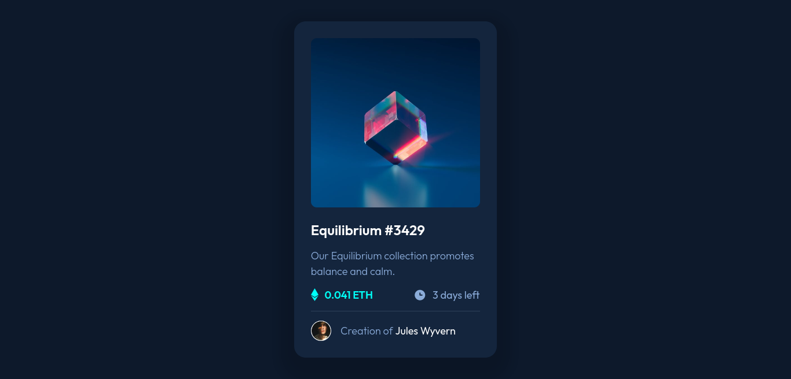

# Frontend Mentor - NFT preview card component solution

This is a solution to the [NFT preview card component challenge on Frontend Mentor](https://www.frontendmentor.io/challenges/nft-preview-card-component-SbdUL_w0U). Frontend Mentor challenges help you improve your coding skills by building realistic projects.

## Table of contents

- [Overview](#overview)
  - [The challenge](#the-challenge)
  - [Screenshot](#screenshot)
  - [Links](#links)
- [My process](#my-process)
  - [Continued development](#continued-development)
- [Author](#author)
- [Acknowledgments](#acknowledgments)

## Overview

### The challenge

Users should be able to:

- View the optimal layout depending on their device's screen size
- See hover states for interactive elements

### Screenshot

### Links

- Live Site URL: [Github](https://lio-n.github.io/FM-NFT-preview-card/)

## My process

### Continued development

I need to get better at naming classes, reusing classes, grid, and something else.

## Author

- Frontend Mentor - [@Lio-n](https://www.frontendmentor.io/profile/Lio-n)
- Twitter - [@_Lio_n_](https://twitter.com/_Lio_n_)
- Linkedin - [Leonardo Fontan](https://www.linkedin.com/in/leonardo-fontan-543b38205/)

## Acknowledgments

I did this challenge on my own, but everything I learned about Frontend, it was thanks to [Apx School](https://apx.school/carreras/dwf)
